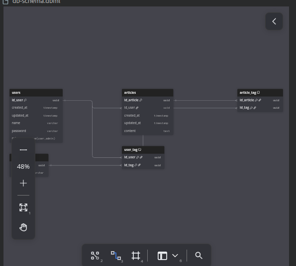

## Visão geral

Este projeto segue uma arquitetura separada em duas camadas principais:

- Backend em Laravel, responsável pela API, autenticação, regras de negócio e persistência.
- Frontend em Next.js, responsável pela interface, consumo da API e experiência do usuário.

O banco de dados utilizado é MySQL, com o esquema documentado no arquivo [db-schema.dbml](db-schema.dbml).

## Arquitetura

O fluxo principal funciona assim:

1. O usuário interage com a aplicação Next.js.
2. O frontend consome os endpoints expostos pelo Laravel.
3. O Laravel processa validações, regras de negócio e autenticação.
4. Os dados são armazenados no MySQL.

Essa separação mantém o frontend desacoplado do backend e facilita a evolução das duas partes de forma independente.

## Stack

- Laravel 13 como backend.
- Next.js como frontend.
- Neon DB (Postgres SQL) como banco de dados.
- Sanctum para autenticação de API e sessão, quando aplicável.
- Vite e Tailwind CSS para assets do projeto Laravel.

## Estrutura do projeto

- `app/` contém a lógica principal do backend.
- `routes/api.php` concentra as rotas da API.
- `database/migrations/` define a estrutura das tabelas.
- `db-schema.dbml` documenta o modelo relacional do banco.

## Observações

Este repositório contém o backend Laravel do sistema. O frontend em Next.js pode viver em outro repositório ou pasta separada, dependendo da organização do projeto.
